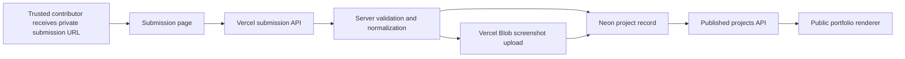

# Neon Project Submission And Portfolio Sync Design

## Summary

Claude Malaysia should move the project-submission workflow from the current browser-local prototype to a Vercel-hosted, Neon-backed MVP. The first version will expose a private-link project submission form to trusted contributors, publish valid submissions immediately, store project records in Neon Postgres, store uploaded screenshot files in Vercel Blob, and render only published project records on the public portfolio page.

The current consultation workflow is not part of this feature. Consultation CTAs can continue pointing visitors toward WhatsApp/contact paths while booking and lead automation are designed later.

## Approved Product Decisions

- Hosting and server-side entrypoints live on Vercel.
- Structured project submission data lives in Neon Postgres.
- Uploaded screenshot files live in Vercel Blob.
- Loom videos remain external URLs stored as project asset links.
- The submission form is reached by a private link shared only with trusted contributors.
- Version 1 does not require login or a shared submission passcode.
- Version 1 publishes a valid submission immediately instead of requiring committee approval first.
- A project visual can be one uploaded screenshot image, one external image URL, or one Loom URL.
- Lead capture, calendar scheduling, and consultation database workflows are deferred.

## Current Repo Context

The repo currently contains:

- `index.html`: public static site, portfolio cards, modal details, consultation CTAs, and contact form UI
- `admin.html`: prototype admin and project form UI that uses client-side password and `localStorage`
- `README.md`: portfolio workflow and taxonomy notes that still mention Supabase
- `ADMIN_PORTAL_PLAN.md`: planned protected admin workflow that still mentions Supabase
- `PROJECT_SUBMISSION_TEMPLATE.md`: field contract and privacy checklist
- `PUBLIC_PAGE_RENDERING_POLICY.md`: public sanitization, layout, and published-record rules

The new MVP should preserve the submission-template taxonomy and public rendering policy while replacing the prototype persistence model. The `admin.html` prototype is useful as product evidence, but it must not be treated as production authentication or production storage.

## Goals

1. Let a trusted contributor submit a project through a direct, unlisted form link.
2. Validate and normalize the submission on the server before it becomes public.
3. Accept one public-safe visual asset path:
   - uploaded screenshot image
   - external image URL
   - Loom URL
4. Persist project data in Neon and uploaded screenshot metadata in the project record.
5. Render published Neon-backed projects on the public portfolio without manual card edits.
6. Keep the public page stable, readable, and safe when submitted content varies.

## Non-Goals

- Public self-serve project submissions linked from the public navigation
- Approval queue before first publication
- Contributor login in the first submission release
- Full admin dashboard in the first submission release
- Lead database storage
- Consultation scheduling integration
- Uploading raw video files
- Replacing Loom as the v1 video hosting path
- Storing binary screenshots inside Postgres

## Architecture



### Runtime Responsibilities

#### Vercel

Vercel serves:

- public portfolio UI
- private-link submission UI
- server-side API endpoints
- environment variables for Neon and Blob access

#### Neon Postgres

Neon stores:

- project content fields
- taxonomy fields
- asset type and asset URL metadata
- publish status and timestamps
- later edit/unpublish metadata

Neon does not store uploaded file bytes in v1.

#### Vercel Blob

Vercel Blob stores:

- uploaded screenshot files

The application stores the resulting Blob URL and asset metadata in Neon.

## Submission Flow

1. A trusted contributor opens the unlisted submission URL.
2. The form presents the fixed project field contract and privacy reminders.
3. The contributor enters required project fields and chooses exactly one visual asset path:
   - upload screenshot
   - paste image URL
   - paste Loom URL
4. The client submits to a Vercel server endpoint.
5. The server validates required fields, taxonomy values, URL formats, description length, upload constraints, and asset choice rules.
6. If a screenshot file was supplied, the file is uploaded to Vercel Blob and the Blob result becomes the project asset URL.
7. The server inserts a normalized project record into Neon with `status = 'published'`.
8. The contributor receives a success state that says the project was submitted and published.
9. The public portfolio fetches published records and renders the new card after the data refresh path completes.

## Publish Model

### Version 1 rule

Every valid submission is published immediately.

### Required status support

Even though approval is skipped in v1, the database and APIs should still model status explicitly:

- `published`
- `unpublished`
- `removed`

This prevents immediate-publish MVP decisions from blocking later safety controls. A future review flow can add `draft`, `pending_review`, or `needs_revision` without redesigning the public renderer.

### Public query rule

The public portfolio query must return only records where:

```text
status = published
```

## Access Model

### Version 1 submission access

The submission form is private by distribution, not protected by authentication.

- Do not link it from the public nav.
- Do not expose it as a public CTA.
- Treat the direct URL as trusted distribution only.

### Consequence

The no-login, no-passcode choice is a deliberate MVP tradeoff. If the URL leaks, an outsider can attempt to submit. Because submissions publish immediately, server validation and rapid removal capability matter more than visual concealment.

### Follow-up safety release

After the first submission release, the next safety increment should add at least one of:

- admin edit/unpublish controls
- submission authentication or invitation token
- stronger abuse controls and alerting

## Data Contract

### Required project fields

The v1 form should align with the current documented submission contract:

- contributor name
- domain specialty or contributor specialty
- project title
- description
- deal type
- service model
- automation layer
- industry
- project type
- data hosting
- tech stack
- complexity
- visual asset

### Asset fields

The project asset model should capture:

- `asset_type`: `uploaded_image`, `external_image`, or `loom`
- `asset_url`: Blob URL, external image URL, or Loom URL
- `asset_alt_text`: public-safe alt text derived from contributor input or project title

### System fields

The data model needs:

- stable project id
- URL-safe slug or public identifier
- status
- created timestamp
- updated timestamp
- published timestamp

### Suggested initial relational model

`projects`

| Field | Purpose |
| --- | --- |
| `id` | internal UUID |
| `slug` | stable public identifier |
| `contributor_name` | public contributor display name |
| `contributor_specialty` | public specialty/domain label |
| `title` | public project title |
| `description` | public 100-200 word project summary |
| `deal_type` | approved taxonomy |
| `service_model` | approved taxonomy |
| `automation_layer` | approved taxonomy |
| `industry` | approved taxonomy |
| `project_type` | approved taxonomy |
| `data_hosting` | approved taxonomy |
| `complexity` | approved taxonomy |
| `asset_type` | uploaded image, external image, or Loom |
| `asset_url` | stored public asset URL |
| `asset_alt_text` | accessible public asset description |
| `status` | public rendering control |
| `created_at` | insert timestamp |
| `updated_at` | mutation timestamp |
| `published_at` | publication timestamp |

`project_tech_stack`

| Field | Purpose |
| --- | --- |
| `project_id` | project relationship |
| `tech_stack_value` | one approved tech-stack taxonomy value |

This split lets contributors select multiple tech-stack values without packing unvalidated text into a single public tag field.

## Validation Rules

### Server-side validation is authoritative

Client validation improves UX, but API validation decides whether a project is saved.

### Required validation

- required text fields must be present
- description must stay within the documented public length policy
- taxonomy values must match the approved taxonomy
- tech-stack values must be approved choices
- exactly one visual path must be supplied
- external image URL must be a valid URL
- Loom URL must be a valid Loom URL
- uploaded screenshot must be an allowed image type
- uploaded screenshot must stay under the configured upload size limit
- input intended for public rendering must be stored as plain data, never trusted HTML

### Rendering safety

Public rendering must:

- avoid raw HTML injection
- clamp or constrain long titles and descriptions
- provide fallback image behavior
- avoid exposing internal notes
- render only public-safe fields

## Public Portfolio Sync

### Current condition

The public page currently has hard-coded portfolio cards and hard-coded modal detail data in `index.html`.

### Target condition

The public page should render cards from a published-project data endpoint instead of requiring manual HTML edits for each new project.

### Migration approach

Use a staged migration:

1. Preserve a stable public-card layout.
2. Build a published-project endpoint with a normalized response shape.
3. Update the portfolio renderer to consume that endpoint.
4. Keep a safe empty/error state if the endpoint is unavailable.
5. Decide whether current hard-coded showcase cards should be seeded into Neon or temporarily remain as fallback content during migration.

## API Boundary

### Submission API

The submission endpoint accepts normalized form data plus the selected asset path. It is responsible for:

- validation
- Blob upload orchestration for uploaded screenshots
- Neon insert
- public-safe success/error responses

### Published projects API

The public endpoint returns only public-safe fields for published projects. It must not return:

- internal identifiers that are not needed publicly
- unpublished records
- removed records
- secret operational metadata

### Future admin API

The future admin layer will need:

- list projects
- edit project
- unpublish project
- remove project

It is explicitly not required for the first submission release, but the status model must leave room for it.

## Environment Configuration

The implementation will need environment variables for:

- Neon database connection string
- Vercel Blob access token or upload configuration

Environment values must be held in Vercel configuration, never committed to the repo.

## Error Handling

### Submission page

The form should distinguish:

- missing required field
- invalid taxonomy selection
- invalid URL
- invalid or oversized screenshot upload
- temporary save/upload failure
- successful publish

### Public portfolio

The public page should:

- render a readable fallback state when project fetch fails
- avoid exposing raw API errors to visitors
- avoid a broken grid if an asset URL fails

## Testing Strategy

### Unit-level checks

- taxonomy validation
- asset-choice validation
- URL validation for Loom and image URL paths
- mapping from database row to public response shape

### Integration checks

- valid external-image submission inserts a published project
- valid Loom submission inserts a published project
- valid uploaded screenshot stores Blob metadata and inserts project record
- invalid taxonomy or unsafe asset input does not publish
- public endpoint excludes unpublished/removed records

### Browser checks

- private submission form renders and handles success/error states
- public portfolio renders fetched project cards
- card layout remains readable on desktop and mobile
- new card asset variants render without breaking the grid

## Delivery Slices

### Slice 1: Contract And Foundation

- update docs from Supabase wording to Vercel + Neon + Blob
- define project schema and taxonomy validation contract
- choose project route/file organization compatible with Vercel

### Slice 2: Private-Link Submission MVP

- build submission form page
- build submission API
- write Neon insert path
- support external image URL and Loom URL

### Slice 3: Screenshot Upload

- add image upload path through Vercel Blob
- save Blob URL and asset metadata in Neon
- enforce file-type and size policy

### Slice 4: Public Portfolio Sync

- build published-project query endpoint
- replace or migrate hard-coded public project rendering
- keep empty/error/fallback states safe

### Slice 5: Safety Follow-Up

- add fast edit/unpublish/removal path
- decide whether private-link access remains acceptable
- revisit authentication/token/passcode protection

## Rationale

This design keeps the current immediate business goal intact: trusted contributors can publish portfolio work without waiting for an admin approval workflow. At the same time, it avoids locking uploaded media into Postgres, avoids relying on the existing browser-local admin prototype, and keeps the public rendering boundary explicit.

It also respects the current scope decision for consultation leads. Contact and WhatsApp can remain usable public CTAs while booking and lead automation are handled as a separate subsystem later.

## Risks And Gaps

1. Private-link publishing without login or passcode can be abused if the URL leaks.
2. Immediate publish increases the impact of bad contributor input, so public validation and quick unpublish controls should not be postponed too long.
3. The current repo uses large single-file HTML prototypes; implementation should avoid deepening that coupling where server routes, schema, and UI can be separated cleanly.
4. Existing README and admin-plan docs still mention Supabase and need to be updated during the contract/foundation slice.
5. Current hard-coded showcase cards need an explicit migration or fallback decision before the public page fully depends on Neon.
